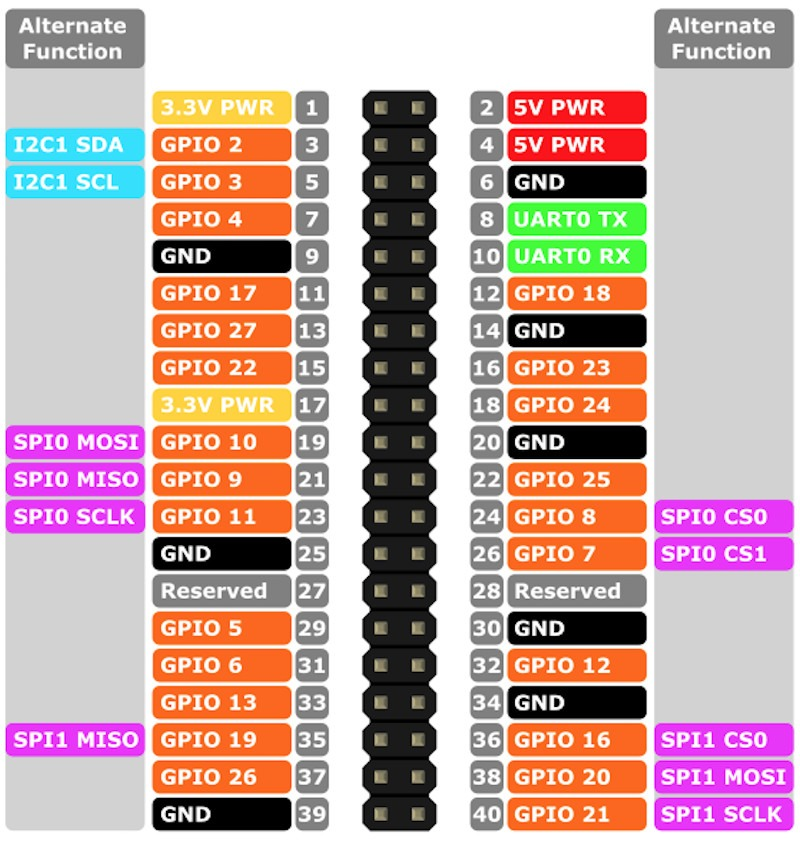

# Screenlib - Pantalla china generica **SSD1306**


Este documento explica los pasos necesarios para habilitar y utilizar una pantalla OLED **SSD1306** (I²C) en Raspberry Pi.

El codigo realizado es solo para entender y aprender como es la comunicacion entre la pantalla y la raspberry utilizando SMBus, NO pretende ser una libreria real (este codigo sera mejorado durante el transcurso del tiempo para ser utilizado en proyectos personales)

---

## 1. Conexión de oled con la raspberry

<p align="center">
  
</p>

* VCC -> PIN 1
* GND -> PIN 6
* SCL -> PIN 5
* SDA -> PIN 3

## 2. Habilitar I²C en Raspberry Pi

1. Edita el archivo de configuración del sistema:
   ```bash
   sudo nano /boot/config.txt
   ```

   o

   ```bash
   sudo nano /boot/firmware/config.txt
   ```
   
2. Busca la línea relacionada con I²C y asegúrate de que esté habilitada:
   ```ini
   dtparam=i2c_arm=on
   ```
   Si aparece `off`, cámbialo a `on`.
3. Guarda y reinicia la Raspberry Pi:
   ```bash
   sudo reboot
   ```

---

## 3. Validar módulos del kernel

Para que la pantalla funcione, deben estar cargados los módulos del kernel que gestionan el bus I²C:

- **i2c-bcm2835** → Driver del hardware I²C del SoC Broadcom de la Raspberry Pi.
- **i2c-dev** → Interfaz de usuario que expone `/dev/i2c-*` para que programas (Python, C, etc.) puedan comunicarse.

### Verificar si están cargados
```bash
lsmod | grep i2c
```

Deberías ver algo como:
```
i2c_dev        20480  0
i2c_bcm2835    16384  0
```

### Cargar manualmente si faltan
```bash
sudo modprobe i2c-dev
sudo modprobe i2c-bcm2835
```

## 4. Detectar la pantalla en el bus I²C

Instala la utilidad:
```bash
sudo apt install i2c-tools
sudo apt install  python3-smbus 
```

Ejecuta:
```bash
sudo i2cdetect -y 1
```

Deberías ver la dirección del SSD1306, normalmente `0x3C` o `0x3D`:
```
     0  1  2  3  4  5  6  7  8  9  a  b  c  d  e  f
00:                         -- -- -- -- -- -- -- -- 
10: -- -- -- -- -- -- -- -- -- -- -- -- -- -- -- -- 
20: -- -- -- -- -- -- -- -- -- -- -- -- -- -- -- -- 
30: -- -- -- -- -- -- -- -- -- -- -- 3c -- -- -- -- 
...
```
----

### Capitulos de youtube
-----
Videos con el proceso de configuración y programación 

1. [Conexión y prueba con Luma](https://www.youtube.com/watch?v=elASqxcndiY)
2. [Dibujando pixel y linea](https://www.youtube.com/watch?v=VSoqzRrRxDo)
3. [Corrigiendo error de dibujado](https://www.youtube.com/watch?v=VveN0igHAqM&pp=0gcJCfsJAYcqIYzv)
4. [Escribiendo texto](https://www.youtube.com/watch?v=_3u2qo9WEdM)
5. [Explicando estructura de fuentes](https://www.youtube.com/watch?v=YNvTG6cu3Hs)
6. [Mostrando temperatura](https://www.youtube.com/watch?v=CNHzoOpp0k4)